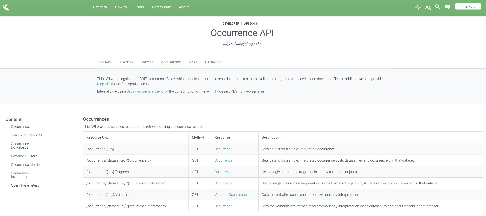

<h1 style="text-align: center;"> Biodiversity Data at your Fingertips</h1>

<h4 style="text-align: center;"> New England Natural History Conference 2023</h4>

<h5 style="text-align: center;"> Michael T. Hallworth, Ph.D.</h5>

<h2 style="text-align: center;"> Introduction to Vermont Atlas of Life </h2>
```{css, echo = FALSE}
.container {
 display: grid;
 align-items: center; 
 grid-template-columns: 1fr 25%;
 column-gap: 1px;
}

.img {
  max-width: 100%;
  max-height:100%;
}

.column {
  float: left;
  padding: 2px;
}

/* Clear floats after image containers */
.row::after {
  content: "";
  clear: both;
  display: table;
}

.callout {
  width: 75%;
  text-align: center;
  font-size: 14pt;
  border-radius: 15px 50px;
  padding: 10px;
  border: 5px solid gray;
  background: lightgray;
  margin: 0;
}
```
<div class = "row">
<div class = "column" style="width: 25%">
</img>
</div>
<div class = "column" style="width: 75%">
<p>In 2013, the <a href="https://val.vtecostudies.org/" target="_blank">Vermont Center for Ecostudies</a> launched the <a href="https://val.vtecostudies.org" target = "_blank">Vermont Atlas of Life</a> (VAL) to gather data on species in Vermont and begin to fill knowledge gaps for Vermont's flora and fauna. The <a href="https://val.vtecostudies.org" target = "_blank">Vermont Atlas of Life</a> is a central library of primary biodiversity data and accumulated knowledge from the past and present. At VAL's core are the community of people contributing and using information about the changing nature of Vermont: occurrence records, monitoring data, distribution maps, photographs, and other data free of charge to anyone---from backyard naturalists to scientists to policymakers. In short, VAL is one of the most ambitious and far-reaching biodiversity informatics projects Vermont has ever undertaken. From this information, we can begin to better understand what's here, what's not, and how biodiversity and species distributions change over time.

The Vermont Atlas of Life has data for nearly 12,000 species across Vermont from 7.7 million occurrence records derived from museum specimens, photographs, and observations by biologists, naturalists, and community scientists.</p>
</div>
</div>


<h2 style="text-align: center;"> The Global Biodiversity Information Facility </h2> 

The Vermont Atlas of Life joins others across the globe in curating primary occurrence records at the <a href="www.gbif.org" target="_blank">Global Biodiversity Information Facility (GBIF)</a>, an international network funded by the world's governments and aimed at providing anyone, anywhere, open access to biodiversity data. 

The GBIF network draws many different data streams such as <a href="www.inaturalist.org" target="_blank">iNaturalist.org</a>, <a href="www.ebird.org" target="_blank">eBird.org</a>, <a href="e-butterfly.org" target="_blank">e-Butterfly.org</a>, <a href="www.OdonoataCentral.org" target = "_blank">OdonataCentral.org</a> and more together by using a data standard known as <a href="https://dwc.tdwg.org/">Darwin Core</a>, which allows occurrence and biodiversity data from many different data publishers to work together seamlessly.

<div style="display: flex; justify-content: center; align-items: center;">
<div class="callout">
In this workshop you'll learn several ways to access primary occurrence records for use in <b>research projects</b>, <b>lesson plans for students</b>, <b>creating species checklists</b> or to simply <b>fulfill your own curiosity</b>.  
</div>
</div>

<h3 style="text-align: center;"> Vermont Atlas of Life's Data Explorer</h3>

<div style="display: flex; justify-content: center; align-items: center;">
<div class="callout">
<b>On your own</b>: Explore the different features of VAL's Data Explorer</b>.  
</div>
</div>

<iframe style="width: 95%; height: 900px;" src="https://val.vtecostudies.org/biodiversity-data-explorer/"></iframe>

<h3 style="text-align: center;"> Understanding the Data </h3>

<h4> <u>Darwin Core Data Standard</u> </h4>
The key to working with data housed at GBIF is understanding Darwin Core (DwC) terms. At first, the data can be daunting because there are <b>250+ fields associated with <i>every</i> occurrence record</b>. The occurrence record fields are in the table below. Some fields are required for an observation while others are optional and may not have data for all observations.  For term definitions see <a href="https://dwc.tdwg.org/terms/#occurrence">DwC terms</a> or see <a href="https://dwc.tdwg.org/list/">list of DwC terms</a>.

```{r echo = FALSE, message = FALSE, warning = FALSE}
library(kableExtra)

emptyData <- read.csv("C:/Users/mhall/State_Of_Biodiversity/DarnerFlightMission/Gbif_data_template.csv")

kableExtra::kable(x = names(emptyData)[2:252],
                  col.names = "DwC term") %>% kable_styling(bootstrap_options = c("striped", "hover", "condensed")) %>% kableExtra::scroll_box(height = "350px")
                  
```

<h4><u>GBIF's API (Application programming interface)</u></h4>

Understanding the data is one thing, being able to access and harness it is another. GBIF allows access to data via different avenues. You can download data directly through GBIF using the <a href="https://www.gbif.org/occurrence/search" target="_blank">occurrence search tool</a>. We won't cover that in this workshop but it's one way to get the data. One huge benefit of downloading the data directly from GBIF is that you get a DOI (digital object identifier) for the dataset you download. The DOI can vastly improve reproducibility and allows users to find and use the same data set as previous research. One downside is that the data files are often <i>very large</i>. The data set of 114,000,000 occurrences for New England is >36 gigabytes. Downloading data can get tedious if you require up-to-date data.

Accessing the data through GBIF's API is fast, and flexible. However, it can be a little overwhelming if you've never used an API service before. The API service is limited but powerful once you learn how to access the data you want. 

Keep this <a href="https://www.gbif.org/developer/summary" target="_blank"> reference guide to the GBIF API</a> handy. You will want to refer back to it often throughout the workshop and beyond. 

<h3 style="text-align: center;"> Interacting with GBIF API </h3>

<div style="display: flex; justify-content: center; align-items: center;">
<div class="callout">
Have a look at the different parameters that can be queried using GBIF's API.  
</div>
</div>
<br>
<a href="https://www.gbif.org/developer/occurrence" target="_blank"></img></a>


<h4 style="text-align: center;"><i>HELP! I've never used an API before where do I even start?</i></h4> 

Using an API is a way to access a database over the internet. The way GBIF's API works is by submitting a query request through your browser. GBIF's database processes your request and returns the data you requested. Below are a few tips on how to submit an API request to GBIF and to make sense of the results. 

First, we need to create the API request. Let's work through a basic example to illustrate how we can do that. Below are the steps to query the API. 

<ol>
 <li>Identify relevant API search parameters </li>
 <li>Use your internet browser to send data request </li>
 <li>Interpret the results</li>
 <li><i>Troubleshoot request if nothing is returned</i></li>
</ol>

<div style="display: flex; justify-content: center; align-items: center;">
<div class="callout">
<b>On your own:</b> Take a few minutes and try and determine how many observations of Common Green Darner (<i>Anax junius</i>) are in GBIF. Expand the code below to see one way to query the API for the data we want.
</div>
</div>
<br>

```{r, class.source = 'fold-hide', eval = FALSE}
# Common green darner 
# scientificName = "Anax junius"

# To search occurrences
# base API call: https://api.gbif.org/v1/occurrence/search?

# parameter to search on: scientificName 
# we want all observations with scientificName="Anax junius"

https://api.gbif.org/v1/occurrence/search?scientificName=Anax%20junius

#count: 31,938 (as of 4/19/2023)
```

Now that you've seen how to submit a basic query to GBIF's API - let's look at the output. 

The API call returns a few different things that we need to pay attention to. First, in the browser there are several options for how to 'view' the results. Consider the image below.
</img>

You can see the API query that we submitted in the browser. The API returned some results based on our query. The API returns a few fields that we need to understand before moving forward. 

<i>offset: 0</i>     
<i>limit: 20</i>     
<i>endOfRecords: false</i>     
<i>count: some number</i>     
<i>results: [...]</i>     
<i>facets: []</i>     

Before we talk about offset, limit and endOfRecords - let's first focus on the <i>count</i> and <i>results</i> fields. 

<b>count</b>: This is how many observations satisfy your API query - i.e., the number of records/occurrences      
<b>results</b>: The data associated with each observation record. This is where all the information stored in DwC format that accompanies an occurrence record is returned. <i>Note: not all 31,398 records are returned!</i>          
<b>limit</b>: Limit used to return observations. Defaults to 20. Maximum number allowed: 300.     
<b>offset</b>: This tells the API where to start returning results. If you want observations 301-600 for example, the offset would need to be set at 300. To get observations 1001-1300 an offset of 1000 should be used. We'll talk more about this later in the workshop.      
<b>endOfRecords</b>: true or false value. If the records returned has reached the end of the records in GBIF a <code>true</code> will be returned - otherwise the value is <code>false</code>

<div style="display: flex; justify-content: center; align-items: center;">
<div class="callout">
How many observations are returned in the results section by default?
</div>
</div>

<br>

<div style="display: flex; justify-content: center; align-items: center;">
<div class="callout">
<b>On your own</b>: How would you alter the API query to return 300 observations? How would you alter the API query to get observations 25,001-25,300?
</div>
</div>
<br>
Once you've given it a try - see one way to satisfy those requirements by expanding the code.
```{r, class.source = 'fold-hide', eval = FALSE}
# Get 300 observations 
https://api.gbif.org/v1/occurrence/search?scientificName=Anax%20junius&limit=300

# Get observations 25,001-25,300 
https://api.gbif.org/v1/occurrence/search?scientificName=Anax%20junius&limit=300&offset=25000
```

Accessing the data via a browser is a great first step into using APIs and to help troubleshoot complex API queries. However, accessing the data in a program where we can summarize, analyze, and map the data can be very powerful. Next, we'll take what we've learned so far and use it to get community science observations into <a href="https://www.r-project.org/" target="_blank">R, a free, open-source statistical computing software</a>. 

<h2 style="text-align: center;"> Using R to query GBIF</h2> 

The benefit of using a program language like R, is that you can retrieve data, analyze it, create maps and reports all in the same program or environment. In addition, the scripts that you write to retrieve and analyze data document the steps you used to get the final products. As such, you have documentation about what was done and makes your project more likely to be reproducible. It also allows you to make changes to the workflow or to redo analyses more easily.

<div style="display: flex; justify-content: center; align-items: center;">
<div class="callout">
To save time during the workshop, I've set up a virtual computing environment that has R installed and all the required packages to complete the exercises and execute code. <b>I highly encourage participants to use the virtual machine during the workshop</b>. Unfortunately, there is no time during the workshop to help participants install R and obtain the required packages. 
</div>
</div>

<h3 style="text-align: center;"> The rgbif package </h3> 

An R package is a set of functions written in R to complete a task. Once the package is loaded into R those functions are available to the user. There is an R package written specifically to interface with GBIF's API. We'll work in R for the remainder of the workshop and use the information we learned about GBIF data and GBIF's API to obtain and analyze community science data. 
For reference - R code looks like the following in the workshop materials. The code can be copied / written directly into the virtual computing environment and run. 

```{r}
# Anything following a pound sign / hashtag / number symbol is not interpreted by R 
# and it handy for writing notes / commenting R code for future reference 

# Hello world
print("Hello World!")
```

The reason why we started the workshop introducing Darwin Core and GBIF's API is because the following workshop materials rely on using those fields to get data. For example, most of the <code>rgbif</code> functions use that information. 

We'll use the <code>rgbif</code> package briefly but like all packages, there are limitations in what it can do. The package is pretty powerful and has lots of different functions we can use. The documentation for the package's functions can be found <a href="https://cran.r-project.org/web/packages/rgbif/rgbif.pdf" target="_blank">here</a>.

Let's get the package loaded into our R environment so we can use the functions by executing the following code.

```{r}
# load rgbif package in R
library(rgbif)
```

Now that we have access to <code>rgbif</code> functions, let's use R to query GBIF's API for Common Green Darner (<i>Anax junius</i>) like we did above in the browser. First, we need to determine which function to use to get the data we want. Recall that we were looking for the total number of Common Green Darner observations in GBIF. 

```{r}
# Use the scientificName method to query API #
# set limit = 20 to match browser default 
# NOTE - the package sets limit=500 by default 
#        and it queries the API twice to get 500 results 

GreenDarnerObs <- occ_search(scientificName = "Anax junius",
                             limit = 20)

# Show similar results as API request - 
# print metadata to the R console
GreenDarnerObs$meta
```

The nice thing about the <code>occ_search</code> function is that it returns the data as well as the counts. Let's first see what the structure (<code>str</code>) of the returned object looks like. 

```{r}
# Inspect what's in the data 
str(GreenDarnerObs,1)
```

You can see there are several things that are returned.      
<code>meta</code>: is the metadata and is similar to what's returned via the browser     
<code>hierarchy</code>: This contains the biological hierarchy of the organism (kingdom,phylum,class,order,....,species and the associated <code>taxonKey</code>)          
<code>data</code>: These are the DwC fields associated with the observation. Most of our workshop will deal with these fields.         
<code>media</code>: Details about any media (mostly photos) submitted with an observation        
<code>facets</code>: Internal calculations from API that we won't use here  


Let's have a quick look at the data returned
```{r}
GreenDarnerObs$data
```

<br>

<div style="display: flex; justify-content: center; align-items: center;">
<div class="callout">
<b>On your own</b>: How would you alter the R code to return 300 observations? How would you alter the code to get observations 25,001-25,300?

<i>Hint: there is no 'offset' available in the <code>occ_search</code> function. Consult the <a href="https://cran.r-project.org/web/packages/rgbif/rgbif.pdf" target="_blank">documentation for the package</a></i>
</div>
</div>
<br>

```{r eval = FALSE, class.source = 'fold-hide'}
# Get 300 observations 
GreenDarnerObs <- occ_search(scientificName = "Anax junius",
                             limit = 300)

# Get 25,000-25,300 observations 
GreenDarnerObs <- occ_search(scientificName = "Anax junius",
                             limit = 300,
                             start = 25000)
```

<br>

<div style="display: flex; justify-content: center; align-items: center;">
<div class="callout">
<b>On your own</b>: Using the rgbif package - query GBIF to find all observations of your favorite taxon that <b>occurred in 2022</b>?

<i>Consult the <a href="https://cran.r-project.org/web/packages/rgbif/rgbif.pdf" target="_blank">documentation for the package</a> to determine how to specify a year range in your query</i>
</div>
</div>
<br>

```{r eval=FALSE, class.source='fold-hide'}

GreenDarnerObs_2022 <- occ_search(scientificName = "Anax junius",
                             limit = 300,
                             start = 0,
                             year = 2022)

```

Now that we have some experience querying data from GBIF using the API - let's grab all the observations of Common Green Darner. Below is the code for how to get all `r prettyNum(GreenDarnerObs$meta$count,big.mark = ",")` observations. This can take a little while depending on the number of observations. Here, I've included the data as part of the workshop materials on the virtual computing machine but I've included the code below for you alter for your own. 

```{r, class.source='fold-hide', cache=TRUE, eval = FALSE}
# # # # # # # # # # # # # # # # # # # # # # # # # # # # # # # # # # # # # # # # 
# 
# THIS CODE IS HERE FOR ILLUSTRATIVE PURPOSES ONLY
# PLEASE DO NOT EXECUTE THIS CODE DURING THE WORKSHOP
# The following code takes approx 25 mins to execute 
#
# # # # # # # # # # # # # # # # # # # # # # # # # # # # # # # # # # # # # # # # 

# Since we know the total number of observations (31,938) we can 
# iterate through the API until all observations are acquired 

# we know the limit of observations per query
limit <- 300 

# set up the values to start at for each query
starts <- seq(from = 0, to = 32000, by = limit)+1

# determine the number of queries are needed #
nQueries <- length(starts)

# Create a list to store data temporarily 
all_obs <- vector('list',nQueries)

# GBIF returns only data fields that have values on that particular page. 
# This can lead to issues down stream. Here, I provide a gbif data template
# so that all the data can be merged seemlessly later. 

gbif_data_template <- read.csv("../gbif_data_template.csv")
  
# Use the information above to get all the data 
# - time the process
a <- Sys.time()

# loop through all different starting values 
# when i = 1, start will equal 1
# when i = 2, start will equal 301
# when i = 3, start will equal 601
# ..
# when i = nQueries, start will equal 31801

for(i in 1:nQueries){

# have an empty data template to fill
empty_template <- gbif_data_template

obs <- occ_search(scientificName = "Anax junius",
                             limit = limit,
                             start = starts[i])

# find the intersecting fields - i.e., keep only the fields that we want
these <- intersect(names(gbif_data_template),names(obs$data))

# store the data in the empty list we created above
empty_template[1:nrow(obs$data),these] <- obs$data[1:nrow(obs$data),these]

# store the data in the list
all_obs[[i]] <- empty_template
}

# see how long the process takes
Sys.time()-a

# combine all the data in the list into a single object
CGD_all_obs <- do.call(rbind,all_obs)

# write data to file 
# saveRDS(CGD_all_obs, "CommonGreenDarner_all_obs.rds")
```

<h2 style="text-align: center:">Using and analyzing the data</h2>

Now that we have some data, let's summarize the data in different ways that may be of interest. 

Read in the full Common Green Darner data set and have a quick look at what's in it using the <code>str</code> function in R. That prints the structure of an object. 

```{r, eval = FALSE}
# read in the data 
CGD_obs <- readRDS("../CommonGreenDarner_all_obs.rds")

# have a quick look at the data #
str(CGD_obs,1)
```

```{r, echo = FALSE}
# read in the data 
CGD_obs <- readRDS("../CommonGreenDarner_all_obs.rds")

# have a quick look at the data #
str(CGD_obs[,1:10],1)
```

<h3 style="text-align: center;"> Phenology </h3> 

Let's find out when during the year Common Green Darner's are observed the most. We can do that using the <code>month</code> in the data set. Our goal is to get the number of observations in each month out of the year and create a plot of those values. That will help users visualize when they are most commonly observed and most active. To do this we can use a function called <code>table</code>. The <code>table</code> function counts the number of times a value is found within a column. Since <code>month</code> there is a month field for every observation with a known date, we can use the <code>table</code> function to get the information we're interested in. 

```{r}
# NOTE: the ( ) around the entire argument below tells R to print the object after 
# it's created

(month_obs <- table(CGD_obs$month))
```

We can see from the data that the most observations are submitted in September (month = 9). We can create a simple plot showing these data. 

```{r, eval = FALSE}
# Create a simple barplot of the data
barplot(month_obs)
```

```{r class.source='fold-hide'}
barplot(month_obs,
        ylab = "Number of Observations",
        xaxt = "n",
        xlab = "Month",
        las = 1)
axis(1, at = seq(0.7,13.9,1.2),labels = month.abb)
```

Let's take a look at the first observation in Vermont for each of the last 10 years. There are many ways to complete that task in R. One way is illustrated below. 

```{r}
# Subset the data and keep only the observations that occur within Vermont 
# here we use the 'stateProvince' field in the data 
# we keep only the rows that satisfy that query and keep all the columns 
# the R syntax follows as such data[row,column]

VTdata <- CGD_obs[CGD_obs$stateProvince=="Vermont",]

# Once we have VTdata we need to select all observations that were observed 
# in 2013 or later 

VTdata_decade <- VTdata[VTdata$year>= 2013,]

# Now that we have the data we want we can find the earliest observation
# date in each year. We can do that using the tapply function. The tapply
# function applies a function to all values of X (eventDate) to each unique 
# value in INDEX (year). The function (FUN) we're applying here is the minimum.

minVT <- tapply(X = VTdata_decade$eventDate,
                INDEX = list(VTdata_decade$year),
                FUN = min, na.rm = TRUE)
```

```{r echo = FALSE}
minVT

minVT_pos <- data.frame(year = names(minVT),
                        date = as.POSIXct(minVT, format="%Y-%m-%dT%H:%M:%S"))

minVT_pos$yearday <- format(minVT_pos$date, "%j")

par(bty = "l")
plot(minVT_pos$yearday~minVT_pos$year,
     ylim = c(100,180),
     pch = 19,
     cex = 2,
     ylab = "Day of year",
     xlab = "Year",
     las = 1)
abline(h = format(as.POSIXct("2023-04-21",format = "%Y-%m-%d"),"%j"),
       lty = 2)
text(y = 112, x = 2015, "Today, April 21")
                        
```

<div style="display: flex; justify-content: center; align-items: center;">
<div class="callout">
<b>On your own</b>: Determine which New England state had the first observation in 2022. 

<i>More challenging</i>: Determine the first observation date for adult, males in every state or province.

<i>Additional challenge</i>: Determine how many observations occur in each state or province.
</div>
</div>

```{r, eval = FALSE, warning = FALSE, class.source='fold-hide'}

# A solution for the first problem 
NEdata <- CGD_obs[CGD_obs$stateProvince %in% c("Vermont","New Hampshire","Rhode Island",
                                               "Connecticut","Maine","Massachusetts"),]

NE_2022 <- NEdata[NEdata$year == 2022,]


minNE <- tapply(X = NE_2022$eventDate,
                INDEX = list(NE_2022$stateProvince),
                FUN = min, na.rm = TRUE)


# Solution for the second # 
AdultMale_data <- CGD_obs[CGD_obs$sex=="MALE" & CGD_obs$lifeStage=="Adult",]

first_male <- tapply(AdultMale_data$eventDate,
                     list(AdultMale_data$stateProvince),
                     min,  na.rm = TRUE)

# state with the most observations? 
table(CGD_obs$stateProvince)
```

<h3 style="text-align: center;"> Explore spatial data </h3> 

<div style="display: flex; justify-content: center; align-items: center;">
<div style="width: 75%;
  text-align: center;
  font-size: 12pt;
  border-radius: 15px;
  padding: 10px;
  border: 2px ForestGreen;
  background: #DCDCDC;
  margin: 0;">
  
We don't have time to go over how to use R as GIS in this workshop. There are lots of great resources online to get you started. I have a similar workshop called <a href="https://mhallwor.github.io/_pages/welcome" target="_blank">Get Spatial! Using R as GIS</a>. It's a little dated now but it follows a similar format to this. 
</div>
</div>

Now that we have the all the data for Common Green Darner, let's see where the observations occur. To do that we'll first need to convert the data into a spatial layer. We'll need to load another R package called <code>sf</code> to do that. Details about the functions found in the <code>sf</code> package can be found <a href="https://cloud.r-project.org/web/packages/sf/sf.pdf" target="_blank">here</a>. Many people use R as GIS and there are a lot of great online resources if you want to get started using R for spatial analyzes. In this workshop, we'll do some basic spatial things without getting into the details.

```{r}
# Load the simple features packages (sf)
library(sf)
```

Now that we have access to all the <code>sf</code> functions we can convert our data in to spatial data. FYI: all <code>sf</code> functions start with <code>st_</code>. In be code below we will convert our <code>CGD_obs</code> into spatially explicit data using the <code>st_as_sf</code> function. We need to provide the data we want to convert (<code>x</code>) and tell the function where the geographic coordinates (<code>coords</code>) are stored in the data. In GBIF the coordinates are stored in the <code>decimalLongitude</code> and <code>decimalLatitude</code> columns. Refer to <a href="https://dwc.tdwg.org/list/" target="_blank">DwC terms</a> if needed. The coordinate reference system (<code>crs</code>) is standard WGS84 (unprojected, longitude latitude). Each different projection has a EPSG number. WGS84 = 4326. Note that the coordinates need to be added in the correct order (Longitude [east/west] then Latitude [north/south]).

```{r, error = TRUE}
Darner_spatial <- st_as_sf(x = CGD_obs,
                           coords = c("decimalLongitude",
                                      "decimalLatitude"),
                           crs = 4326)
```

<b>We received an error message</b> The error message tells us that <code>NA</code> (empty) values are not allowed. Rather, it's not possible to make a spatial layer of some observations that don't have coordinates. Let's remove the observations without coordinates and try again. 

```{r, error = TRUE}
# Remove observations with empty coordinates 
# Keep all observations that are not (!) NA

CGD_obs_coords <- CGD_obs[!is.na(CGD_obs$decimalLongitude),]

Darner_spatial <- st_as_sf(x = CGD_obs_coords,
                           coords = c("decimalLongitude",
                                      "decimalLatitude"),
                           crs = 4326)
```

Our new spatial object <code>Darner_spatial</code> has a new column called <code>geometry</code>. Let's take a quick peek at the differences between our two objects (<code>CGD_obs</code> and <code>Darner_spatial</code>).

```{r, eval = FALSE}
# CGD_obs (non-spatial)
head(CGD_obs)

# Darner_spatial (spatial)
Darner_spatial
```

Let's make a simple plot of the observations to determine where they were observed.
```{r}
# To plot just the locations we need to specify "geometry"
# note the $ sign means get the "geometry" column in the Darner_spatial object
plot(Darner_spatial$geometry,
     main = "Common Green Darner Observations in GBIF", # title of plot
     pch = 19,   # filled in dots
     cex = 0.5)  # size of dots
```

<h3 style="text-align: center;">Calculate a simple distribution </h3>

We can see from the figure above that Common Green Darner have been observed in Europe and Asia. Let's assume for this analysis we're only interested observations that occur in North America. The code below will keep only the observations that occurred within North America. 

```{r}
# Get a tally of all observations in different continents
table(Darner_spatial$continent)

# Keep all the rows where the column continent = "NORTH_AMERICA"
NorthAm_CGD <- Darner_spatial[Darner_spatial$continent == "NORTH_AMERICA",]

plot(NorthAm_CGD$geometry)
```

Looking good! Now that we have just the North America observations we can calculate a simple range for the species. To do this we'll use a minimum convex polygon (<code>st_convex_hull</code>) This is a relatively crude way to estimate range size but it's relatively simple to do. The function will take all the spatial points and create a polygon around the observations. We'll use that as it's range. 

```{r, cache = TRUE}
# covert the points into a single multipoint so all points are considered 
# then create a minimum convex polygon 

a <- Sys.time()
DarnerRange <- st_union(NorthAm_CGD) %>% st_convex_hull()
Sys.time()-a

```

```{r class.source='fold-hide'}
plot(NorthAm_CGD$geometry, col = "gray60", pch = 19)
plot(DarnerRange, add = TRUE, lwd = 2, border = "black")
```

Let's just focus on continental North America - i.e., take out Hawaii and Alaska

```{r, cache= TRUE}
# Take out Hawaii and Alaska obs 

Cont_CGD <- NorthAm_CGD[NorthAm_CGD$stateProvice %in% c("Hawaii","Alaska"),]

# covert the points into a single multipoint so all points are considered 
# then create a minimum convex polygon 
a <- Sys.time()
DarnerRange_cont <- st_union(Cont_CGD) %>% st_convex_hull()
Sys.time()-a

```

```{r class.source='fold-hide'}
plot(Cont_CGD$geometry, col = "gray60", pch = 19)
plot(DarnerRange_cont, add = TRUE, lwd = 2, border = "black")
```

Below we calculate the area of the minimum convex polygons. However, to get an accurate estimate we first should project the data into an equal area projection. We do that below. 

```{r}
area_m_all <- st_transform(DarnerRange, crs="ESRI:102008") %>% st_area()
area_m_cont <- st_transform(DarnerRange_cont, crs = "ESRI:102008") %>% st_area()
```

The size of the range that includes all North American observations is `r prettyNum(area_m_all, big.mark=",")` meters, or `r prettyNum(area_m_all/1e6,big.mark=",")` square kilometers. Compare that to the continental observation range `prettyNum(area_m_cont, big.mark=",")` meters, or `r prettyNum(area_m_cont/1e6,big.mark=",")`.


